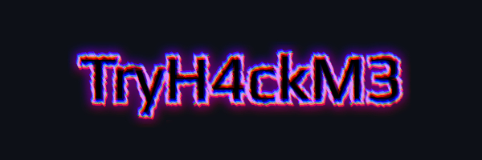

##  About Me:
🛠 Infosec Enthusiast, Reverse Engineer, CTF Player, Arch linux user
  
Hi, I'm TryH4ckM3. I love to play CTF and write challenges for them. My favourite programming languages are C and C++. I use arch btw.

## Contact me:

 

## 💻 Tech Stack:

  
## 📊 GitHub Stats:

